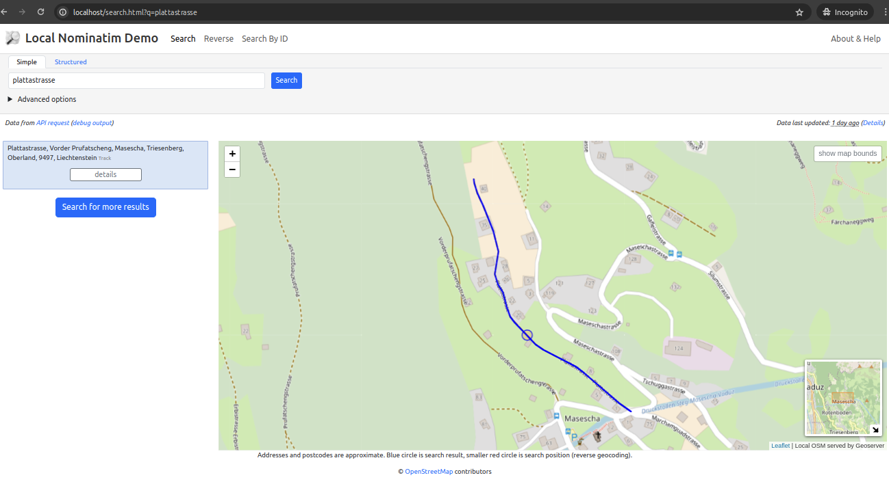
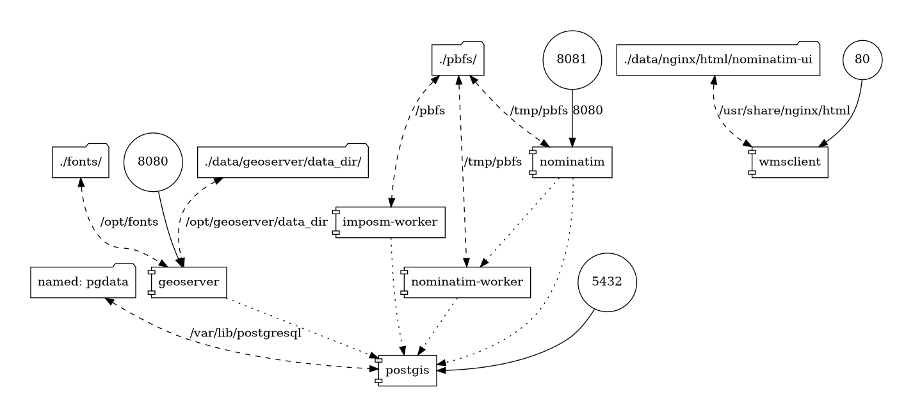

# OSM & Geocoder locally served capabilities demo

This solution provides a simple deployment based on docker-compose (with a demo page) for getting you own OSM tiles mapserver with Geocoder capabilities.



## Steps

With the scripts that are included in the folder we have simplified the steps to deploy the solution.

**Preconditions:**

Note: you can check preconditions executing script **check-preconditions.sh**

1. Install [git](https://github.com/git-guides/install-git), [docker](https://docs.docker.com/engine/install/ubuntu/) and [docker compose (V2)](https://docs.docker.com/compose/install/) on the host machine.

2. Download the repository of this project.

   ```
   git clone https://github.com/geotekne-argentina/osm-nominatim-geoserver-postgis
   ```

3. Optional: edit file **config.sh** and select which PBF file to download (from GeoFabrik, https://download.geofabrik.de/), otherwise default demo will download by default PBF file (Liechtenstein).

**2 Steps**

1. Execute setup-datasets.sh script

   ```
   ./osm-nominatim-geoserver-postgis/setup-datasets.sh
   ```

2. Once the datasets setup is finished, then execute startup.sh script

   ```
   ./osm-nominatim-geoserver-postgis/startup.sh
   ```

**IMPORTANT:**
 - ensure that mapped ports (80,8080 and 8081) in your host are available and free to use.
 - remember to run the ./setup-datasets.sh script so you will be downloading the LOW resolution file.

Observations :

- OSM Data reset: Every time the docker compose is initialized, it is validated if there are files to import in the PBFs folder, and so the information of the OSM layers is reset. Only in the case of having the folder empty, that is to say without PBF files, is that the existing information on the pgdata volume will not be reset. So we suggest to run the ./setup-datasets.sh script at least one time, and then to add your PBFs files in the ./pbfs folder. After first execution of ./start.sh script (that will trigger the import process) we suggest to remove the PBFs files from the ./pbfs folder otherwise the import process will execute every time you start the docker composition)

(*) The initial version of this file comes from this repository https://github.com/geosolutions-it/osm-styles (in the README you will find the link to download it from Dropbox), but it has errors/imperfections in certain areas - product of the treatment to lower the resolution - that have been corrected.

## Technical Details

This docker composition includes a: 
- Postgis database with 2 schemas, one for OSM data used in context of Geoserver and one for Nominatim server
- Nominatim server, which on startup ingest data from a PBF mounted on a volume
- IMPOSM worker, which executes only one time and ingest data into OSM data schema for Geoserver based on the same PBF file mentioned before
- Geoserver instance, which serves WMS tiles generated using the OSM data in Postgis, using the catalog configuration, allowing to change styles dinamically, etc (also exposing OSM data via WFS)
- Nominatim-UI which uses all the local capabilities provided by the local Nominatim and the Geoserver basemaps.
- Ports mapped on host:
  - geoserver: 8080
  - postgis: 5432
  - nominatim-ui:80
  - nominatim: 8081


## Diagram

